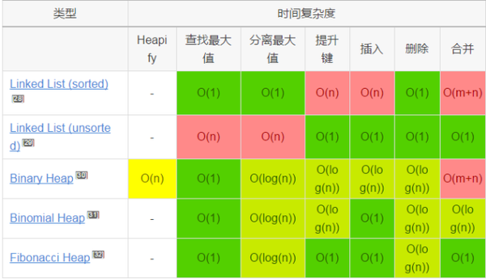

# General

 - arrive 30 mins before test

 - [雅思AG类！](https://zhidao.baidu.com/question/137051250.html)
    - 这两类考试的听力是完全一样的，口语稍有不同，阅读不一样，A类未说明文和议论文阅读，侧重知识性和学术性；而G类第一篇第二篇为应用文阅读（比如给你几个酒店海报）第三篇为学术性阅读与A类相似。作文A类小作文是图型题，大作文是议论文，G类小作文为应用型（如书信，录取通知书等），大作文与A类相似。
      难度方面：听力，口语一样。阅读A类难，但相对的评分标准也低，作文评分标准不一样。但其实是公平的，因为简单评分标准就高。这个你可以百度一下。
 - [雅思考试评分标准](http://jingyan.baidu.com/article/fec7a1e52010781190b4e7c4.html)
 - [雅思大小作文字数控制在多少合适？](http://ielts.xiaoma.com/20150401/xz-fyr-ysxz.html)
    - 最佳安排：小作文 150-170字 大作文 250-275字
 - [雅思写作总得低分?这些表达不能继续用了!](http://news.liuxue360.com/language/00557907.html)
    
    
# Cambridge
 
 - 8
    - test 1
        - listening 32/40 (19/12/2016)
            
            
# Road to IELTS
 
 - http://roadtoielts.chinaielts.org
    - writing
        - http://roadtoielts.chinaielts.org/area1/RoadToIELTS2/Start-GT.php?prefix=TD
            - 
            
# Xindongfang Band 9

 - speaking bookmarks (216 in total)
    - 23 27/12/2017
 
 - writing bookmarks
 