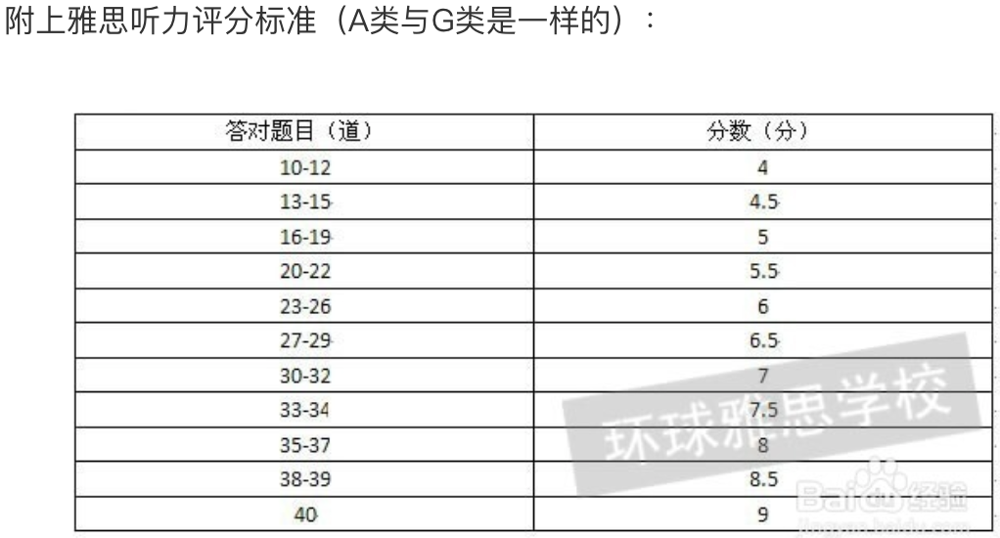
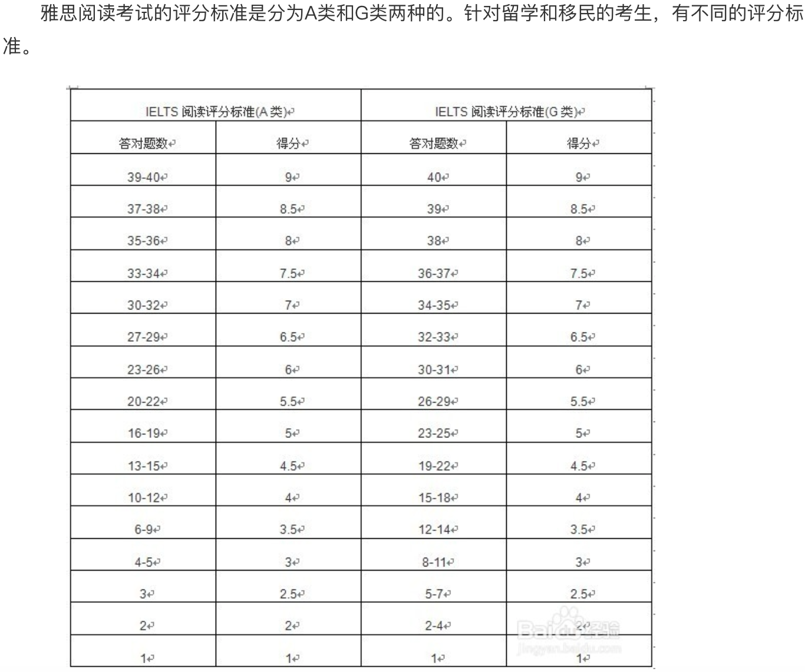

# General

 - arrive 30 mins before test

 - [雅思AG类！](https://zhidao.baidu.com/question/137051250.html)
    - 这两类考试的听力是完全一样的，口语稍有不同，阅读不一样，A类未说明文和议论文阅读，侧重知识性和学术性；而G类第一篇第二篇为应用文阅读（比如给你几个酒店海报）第三篇为学术性阅读与A类相似。作文A类小作文是图型题，大作文是议论文，G类小作文为应用型（如书信，录取通知书等），大作文与A类相似。
      难度方面：听力，口语一样。阅读A类难，但相对的评分标准也低，作文评分标准不一样。但其实是公平的，因为简单评分标准就高。这个你可以百度一下。
 - [雅思考试评分标准](http://jingyan.baidu.com/article/fec7a1e52010781190b4e7c4.html)
    - 
    - 
 - [雅思大小作文字数控制在多少合适？](http://ielts.xiaoma.com/20150401/xz-fyr-ysxz.html)
    - 最佳安排：小作文 150-170字 大作文 250-275字
 - [雅思写作总得低分?这些表达不能继续用了!](http://news.liuxue360.com/language/00557907.html)
    
    
# Cambridge
 
 - 8
    - test 1
        - listening 32/40 (19/12/2016)
            
            
# [Road to IELTS](http://roadtoielts.chinaielts.org)
 
## writing

<b>WORD IN A SENTENCE<b>

 - writing set 3 task 1 (informal expressions)
    - abbreviation
    - All the best,
    - Love,
 - writing set 3 task 1 (formal expressions)
    - preposition
    - http://www.masteringgrammar.com/2012/05/yours-sincerely-yours-faithfully.html
        - Dear Sir/Madam, Yours faithfully,
        - Dear xxx, Yours sincerely,
 
## reading

 - skim first
    - first paragraph, find out what the passage is about
    - go to each paragraph, find the first sentence, topic sentence
    - read the last sentence of the concluding paragraph
 - go to questions
    - synonyms
    
 - t f y n true false yes no
 
## listening

 - key words
    - and secondary, moving to the next point, and most importantly
 - synonyms
    -  foresee
 - topic
   
                          
# Xindongfang Band 9

## Speaking

 - speaking bookmarks (216 in total)
    - 43 27/12/2016
    - 94 30/12/2016
    - 135 31/12/2016
    - 135-150/216
    - 198-216/216
    
 - notes
    - Only in part 3 the examiners will rephrase a question if you do not understand it. In part 1, they will repeat and then move over to the next question.
    - you will not be penalized for speaking more then 2 minutes in part 2 despite the examiners will stop you.
    - no difference between acadamic and general training test
    
 - should
    - try to say 3 sentences for each question in part 1
    
 - practice
    - repeating after a recording
        - use sound links, contractions and weakened forms to match their speed
    - repeat the same topic
    - Signpost expressions  
    - nervous, tired and scared
    - record
    - <b>complex sentence</b>
    - question, position, supports
    
 - materials
    - hometown
    - jobs
    
 - expressions
    - Firstly
    - By this I mean
    - For instance
    - In contrast
    - To be honest
    - cook up a storm in the family kitchen
    - the most compelling reason is that
    - the most obvious explanation is 
    - coupled with the fact that
    - put it down to 
    - attribute it to the fact that
    - it is all thanks to 
    - have a knack for
    - a bit of know-it-all when it comes to
    - don't know the first thing
    - can't ... for nuts
    - not much of a 
    - chalk and cheese
    - bear no relation to 
    - in regards to
    - a world of difference
    - regarded as
    - distinguishing features
    - what sets ... and ... apart is
    - the most striking resemblance is 
    - as far as I can tell
    - draw a distinction between 
    - a classic example
    - a prime example
    - a typical example
    - in one case
    - a case in point is
    - to name but a few  
    - as long as
    - provided that
    - head off to
    - unless
    - on condition that it's not overcast
    - supposing that I was laid off
    - say that
    - bring forward
    - on the plus side
    - make it over in time to
    - one of the added benefits is 
    - an absolute hive of activity
    - which compares with mine
    - speaking from experience
    - travel extensively
    - if I remember rightly, back in 1990...
    - nothing short of spectacular
    - everyone was bored out of their brains
    - harrowing experience
    - a loaf of bread
    - from bitter experience
    - loathe
    - despite
    - object to
    - am sickened by
    - am disgusted by
    - [a real turn-off](https://zhidao.baidu.com/question/573175645.html)
        - 3(使某人)感到厌烦 
    - the implication of 
    - insecure employees
    - in search of greener pastures
    - the end result is
    - I'm of the opinion that
    - is only beneficial if 
    - if you ask me
    - to the best of my knowledge
    - as far as I'm concerned
    - to my mind
    - the more, the fewer ... and the closer ...
    - what I'm trying to say is 
    - that is to say
    - in other words
    - what I mean is
    - as opposed to the past when 
    - by this I mean
    - the thing is 
    - make ends meet
    - express package tours
    - to put it another way
    - all I'm saying is
    - put it this way
    - the generalisations and stereotypes
    - there is no one like
    - nobody compares to
    - I have a soft spot for
    - I think the world of
    - is as a good place as any
    - there is no place like
    - nowhere compares to
    - when comparing ... to other ...
    - if you compare ... to other ...
    - comparatively speaking
    - the most authentic oriental experience
    - are becoming increasingly opulent and up-market
    - given the choice
    - If I had to take a pick
    - I'd favour
    - I'd go for
    - is no match for
    - from ... to ... and even ...
    - one of the reasons ... is that
    - plays a major part in
    - I'd put it down to the fact that
    - the only reason that comes to mind is
    - then again
    - all the same
    - even so
    - while ... has a lot to offer, there's nothing like ...
    - having said that ...
    - whereas
    - I highly recommend
    - If you want my advice, you ought to
    - take my advice
    - no matter what
    - You'd be well advised to
    - on no account should you 
    - takes the cake
    - the pick of the bunch would have to be
    - nothing compares to
    - ... is head and shoulders above the rest
    - you can't beat ... for 
    - runs rings around the others
    - put the rest to shame
    - is streets ahead of the rest
    - what makes it a cut fact above other ... is the fact that
    - I've never been known to 
    - once in a blue moon
    - on and off
    - now and again
    - every so often
    - every once in a while
    - whenever I get the chance
    - from time to time
    - hundreds of times
    - there is no such time as bedtime
    - I spend a greater part of every weekend
    - I have spent a life time 
    - at the end of the day
    - in all probability
    - in all likelihood
    - there's every possibility
    - there's every likelihood
    - it's more than likely
    - there's a remote prospect of 
    - there's a slight prospect of
    - I'd attribute it to the fact that
    - in stark contrast
    - the root of the problem is
    - I'd put it down to
    - I'd put it before ... to 
    - on the whole
    - on the downside
    - one of the major contrasts is
    - what sets ... apart is
    - the most striking resemblance is
    - they are identical in terms of
    - and another thing
    - stems form the fact that
    - all things considered
    
 - Adverbs
    - unbelievably 
    - remarkably
    - incredibly
    - exceptionally
    
    - awfully
    - terribly
    - dreadfully
    
    - fairly
    - reasonably
    - moderately
    - rather
    - somewhat
    
## Writing   
 
 - writing bookmarks
    - 219-311/314 task 1
        - 231 02/01/2017
        - 240 03/01/2017
        - 249 03/01/2017
    - 122-219/314 task 2
        - 133 02/01/2017
        - 142 03/01/2017 --->
        - 152 03/01/2017
        - 161 03/01/2017
   
 - Questions
    - agree or disagree
        - opinion
            - first
                - Issue
                - Raise questions
                - Despite ... I ...
                - Reasons
            - second
                - Topic
                

                - Example
                - Support
                

                

                - Admittedly
                - Nevertheless
                

            - third
                - Topic
                

                - Example
                

                

                - Example
                - Conclude briefly
                

            - fourth
                - Conclusion
                - Although ..., it ...
        - agree or disagree
    - causes, effects and solutions
 
 - notes
    - it is essential to use precise and accurate vocabulary, including preposition, in order to get a high band.
    
 - speaking English
    - I think ...
    
 - expressions
    - imagine what would happen -> unreal and imaginary situations
    - imagine what will happen -> planned situations
    
### Task 1
    
 - Letters
    - formal
        - Dear Mr ..., Yours sincerely,
        - Dear Sir/Madam, Yours faithfully,
        
    - informal
        - acquaintance
        - abbreviation
        - Dear ..., Regards,
 
 - expression
    - 21 Internet connection problems
        - thus far
        - lodge a complaint about
        - read closely
        - by comparison with
        - prior to
        - indicate
        - unlimited access to 
        - upon arrival
        - other such ...
        - fellow students
        - as you are no doubt aware,
        - Considering ...,
        - entirely unreasonable
        - irrational
        - affordable alternatives
        - when it comes to...
        - your assistant in this matter is greatly appreciated
    - 22 delayed flight
        - I am writing with regard to 
        - I was initially booked to 
        - leave ... for ...
        - the first leg 
        - the outgoing journey
        - uneventful
        - in the boarding lounge
        - at ... airport
        - due to commence work
        - band 6, ... was entirely to blame for this ...
        - foul-up
        - at such short notice
        - entirely the fault of ...
        - I feel that compensation in the form of a complimentary ticket of the same distance would be warranted.
        - supplied
        - A swift reply would be greatly appreciated.
    - 23 problems with a rental car
        - branch
        - representatives
        - dependable
        - vehicle
        - mechanical
        - stranded
        - To make matters worse,
        - Consequently
        - , first ... and then ..., 
        - summer hot
        - in the summer heat
        - entitled to request a full refund
        - prompt resolution of this matter
        - would be doing 
    - 24 low IELTS score
    - 25 university clubs
    - 26 university entrance requirements
    - 27 missed immigration interview
    - 28 saying goodbye
    - 29 in hospital
    - 30 change of plans
    
 
 
### Task 2
 - 11 the Internet
    - grammar
        - `--`
        - `-`
        - ()
        - ,,
        - The Internet has brought significant changes to our lives in recent years.
        - Yet, there remains some disagreement as to whether the overall impact of ... has been positive or negative.
        - While there are certain valid arguments to the contrary ...
        - Equally importantly,
        - despite
        - nevertheless
        - by way of conclusion, I once again reaffirm that 
        - admittedly
        - recently, in recent times (PP)
    
    - vocabulary/lexis
        - ... and ...
        - ... or ...
        - *reaffirm/restate
        - *impact
        - far overweight
        - the benefits are twofold
        - indisputable fact
        - revolutionise
        - a problem occasionally seen in 
        - incredibly useful and powerful
        - facilitate
        - a vast amount of 
        - offensive
        - pornography
        - change -> alter
        - talk to -> relate to 
        - friends and families -> loved ones
        - involve -> entail
        - can be accessed
        - reliable
        - in earlier times
        - faraway places
        - global trade
        
 - 12 fast food
    - grammar
        - The past 50 years have seen a dramatic increase in the availability of fast food.
        - Two of the primary drawbacks associated with this trend are listed as follows. 
        - Moreover,
        - in other words
        - further and even more importantly, though, 
        - it is also interesting to note that
        - Having grown up doing ...
        - Given the ... risks associated with this trend, I believe...
        - has a positive role to play in the world
    
    - vocabulary/lexis
        - laud
        - relatively low cost
        - detrimental
        - at large (society at large)
        - undeniable fact
        - to excess
        - illnesses -> ailments (such ailments as high blood pressure, obesity ...)
        - affordable
        - deliberately
        - Ronald McDonald
        - a beacon to
        - playgrounds
        - warranted
        - major health problems
    
 - 13 international tourism
    - grammar
        - The past 50 years have seen a considerable increase in ...
        - this is unlikely to occur while 
        - one particularly salient example of this is     
    - vocabulary/lexis
        - undeniable economic prosperity
        - host countries
        - international holidaymaking
        - holidaymaker
        - has been in fact negative
        - wealthy 
        - affluent
        - influx
        - prostitution, alcoholism and drug abuse
        - foster
        - understanding and tolerance
        - potent symbol of western cultural domination
        - moral decadence
        - degradation
        - decades
        - snorkellers
        - sustainable
        - renowned
        - booming
        - numerous and complex
        - insurmountable
        - foreseeable future
        
             
 - 14 immigration
    - grammar
        - this raises certain questions about  
        - Although there are valid arguments to the contrary, in this paper I will argue that ...
        - The reason for this are twofold
        - Imagine the chaos that would ensure if ...
        - It is, therefore, for all ...
        - Two further instances of practices which are ... are ...
        - Secondly and more importantly, though, 
        - It is my belief that 
        - , whereas
    - vocabulary/lexis
        - integration
        - immigrants
        - accepted rules of behaviours
        - both written and unwritten
        - vitally important
        - for the sake of 
        - chaos
        - etiquette
        - regardless of 
        - possession
        - permitted
        - prohibited
        - societal cohesion
        - social norms
        - legislation
        - vibrancy
        - contend
        - undermine
        - diversity
        - alienate
        - tendency
        - homogeneous
        - blurred
        - obey -> observe the laws
        - unite

 - 15 jobs and gender
    - grammar
              
    - vocabulary/lexis
    
 - 16 cigarette smoking
    - grammar
              
    - vocabulary/lexis
    
 - 17 endangered species
    - grammar
              
    - vocabulary/lexis
    
 - 18 rural depopulation
    - grammar
              
    - vocabulary/lexis
    
 - 19 distance within families
    - grammar
              
    - vocabulary/lexis
    
 - 20 declining educational standards
    - grammar
              
    - vocabulary/lexis
